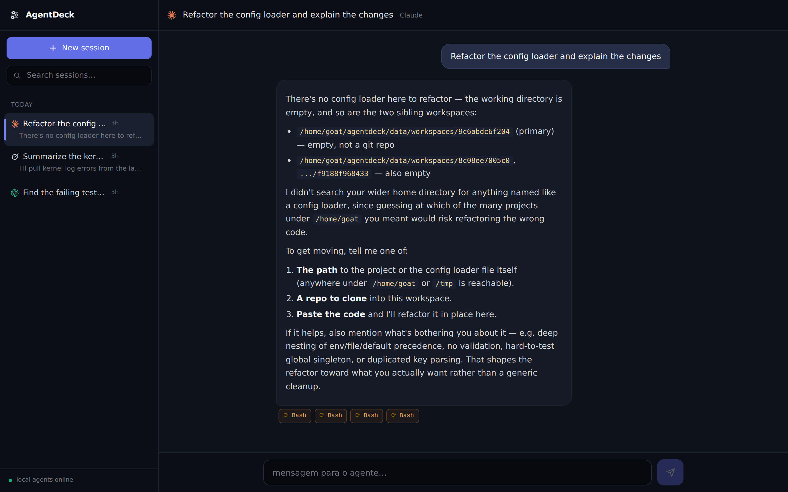

# AgentDeck

**The web cockpit for local AI coding agents.**

[](https://github.com/cfpperche/agentdeck/actions/workflows/ci.yml)
[](LICENSE)



Agent CLIs are powerful — and terminal-bound. The moment you leave your
computer, your agents stop working. AgentDeck wraps the agents you already
have installed (**Claude Code, Codex, Grok, Pi, OpenCode**) in a web app
with persistent sessions, real-time streaming and remote access, so they
keep running on your machine while you are anywhere.

```
 browser (phone / laptop, anywhere)
    │  HTTPS · tailnet / LAN
    ▼
 AgentDeck server  ──  SQLite (sessions, history)
    │  subprocess · JSONL streaming
    ▼
 claude │ codex │ grok │ pi │ opencode
```

## Features

- **Continuous sessions** — create, rename, delete, resume whenever you
  want. Each agent resumes its *native* session (`claude --resume`,
  `codex exec resume`, `grok --resume`, …), so context survives across
  messages and restarts
- **Real-time streaming** — assistant text and tool calls arrive via SSE
  while the agent works; stop button kills the process
- **Multi-agent** — route each session to a different agent; installed
  CLIs are auto-detected
- **Per-session workspace** — every session gets an isolated scratch
  directory
- **Markdown rendering** — syntax-highlighted code, copy buttons, tables
- **Mobile-first UI** — works from your phone over [Tailscale](https://tailscale.com)
  (or LAN); no cloud service involved

## Supported agents

| Agent | Streaming | Native sessions | Notes |
|---|---|---|---|
| Claude Code | text + tool events | `--resume <id>` | session id from init event |
| Codex | JSON item events | `exec resume <thread_id>` | `workspace-write` sandbox |
| Grok | JSON deltas | `--resume <id>` / `--continue` | automatic fallback chain |
| Pi | JSON deltas + tools | `--session <id>` | |
| OpenCode | JSON events | `--session <id>` | provider must be configured |

Adding an agent is an adapter: one command builder + one event parser
(see `legacy/backend/agents.py`, being ported to `internal/agent/`).

## Quick start

> **Status: Phase 1.** The Go port is the primary implementation (single
> binary). The Python prototype stays in `legacy/` until parity is proven
> in the field — see [Roadmap](#roadmap).

**One-liner** (downloads a release binary into `~/.local/bin`):

```bash
curl -fsSL https://raw.githubusercontent.com/cfpperche/agentdeck/main/scripts/install.sh | bash
# add --systemd to install and start the systemd user unit as well
```

**From source** — prerequisites: one or more agent CLIs installed and
authenticated, Go 1.22+ and Node 22+.

```bash
git clone https://github.com/cfpperche/agentdeck
cd agentdeck
make build        # web UI + single binary → bin/agentdeck

./bin/agentdeck   # HTTPS on :8444 (self-signed cert auto-generated)
```

<details>
<summary>Python prototype (legacy)</summary>

```bash
python3 -m legacy.backend.__main__
```
</details>

Open `https://localhost:8444`, accept the self-signed certificate, pick an
agent, send a task.

**From your phone:** the recommended setup is Tailscale on both machines —
open `https://<tailnet-ip>:8444` and it works from anywhere, encrypted
inside your private network.

## Execution modes

AgentDeck can run under your regular user or under a dedicated system user
(feature-flagged `run_mode`, see [ADR-0002](docs/adr/0002-execution-modes-feature-flag.md)):

| | `personal` (default) | `dedicated` |
|---|---|---|
| Setup | zero config | via [aiagent-linux](https://github.com/cfpperche/aiagent-linux) or manually |
| Agent privileges | your user's | isolated user, optional sudo allowlist |
| Data | `~/agentdeck/` | dedicated home |
| Trade-off | agents inherit your credentials | one extra setup step |

## Security

This software lets a browser execute agent CLIs on your machine. Read
[docs/SECURITY.md](docs/SECURITY.md) before exposing it to any network —
the short version: bind to localhost or a tailnet, never to the public
internet (an auth layer is on the roadmap).

## Repository layout

```
main.go                  # entrypoint (Go port, in progress)
internal/                # Go packages: agent adapters, runner, store, server
web/                     # React SPA (Vite + Tailwind)
legacy/                  # Phase-0 Python prototype (currently the running impl)
docs/                    # SECURITY, ADRs, screenshots
.github/                 # CI, issue/PR templates
```

## Roadmap

- [x] **Phase 0** — prototype validated end-to-end; repo, docs, ADRs, CI
- [x] **Phase 1** — Go port with TDD (fake agents as test doubles),
  single binary embedding the web UI (`go:embed`), native self-signed TLS
- [ ] **Phase 2** — execution-mode feature flags, install script,
  Homebrew tap, versioned releases with checksums
- [ ] **Phase 3** — hardening: token auth, rate limiting, zombie-process
  reaping, metrics

## Contributing

Issues and PRs are welcome — see [CONTRIBUTING.md](CONTRIBUTING.md).
The repo language is **English** (docs, code, comments, commits).

## License

[MIT](LICENSE)
